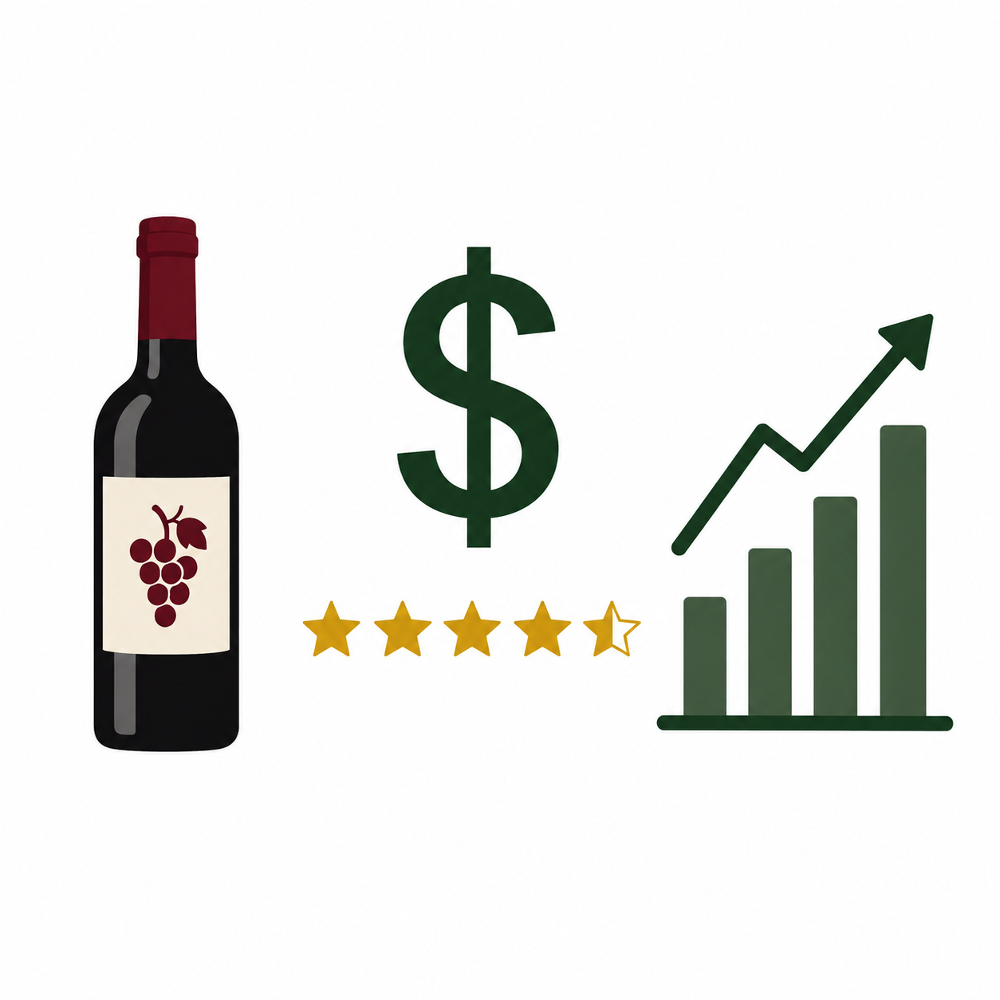

<h1>
  
  Wine Quality Analysis
</h1>

Analysis of 1,599 red wines using Python to identify the chemical factors that predict wine quality ratings (scored 3-8).

# What This Project Does
- Explores the dataset for class imbalance and data quality issues
- Uses correlation analysis and SelectKBest feature selection to identify key predictors
- Compares high quality (7-8) vs low quality (3-4) wine chemical profiles
- Tests three models: Linear Regression, Logistic Regression, and KNN Classifier

#  Results
- Alcohol content and volatile acidity are the two strongest predictors of quality
- 82.5% of wines are rated 5 or 6 - a heavy class imbalance that limits model performance on rare scores
- All three models struggle with scores 3, 4, and 8 for the same root cause: the data is imbalanced, not the models

# Files
- `nyoagsample.py` - main analysis script
- `winequality-red.csv` - dataset
- `heatmap.png` - feature correlation heatmap
- `residual_plot.png` - linear regression residual plot
- `confusion_matrix.png` - KNN classifier confusion matrix

## Tools
Python, pandas, scikit-learn, matplotlib, seaborn

## How to Run
```bash
python nyoagsample.py
```
